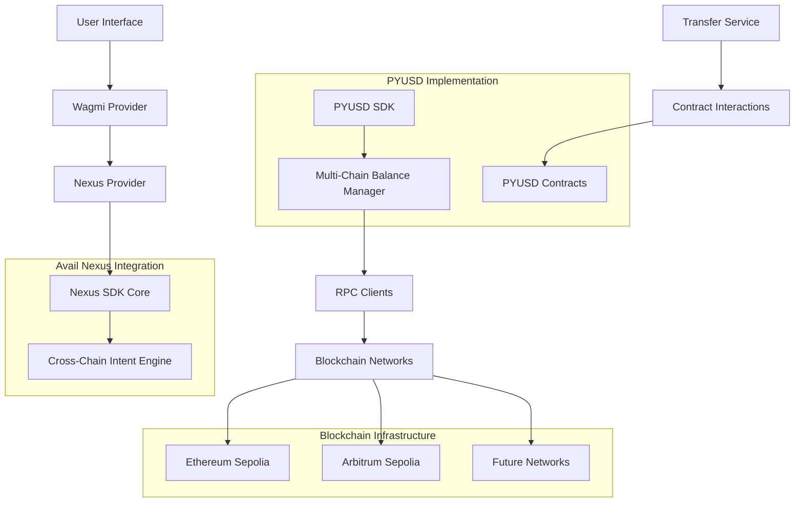

# 🚀 PYUSD Cross-Chain Nexus Bridge

> **ETH Online 2024 Hackathon Submission**  
> A revolutionary DeFi application that enables seamless PYUSD transfers across multiple blockchain networks using Avail Nexus SDK's cutting-edge cross-chain infrastructure.


## 🏆 Qualification Achievements

### ✅ Avail Nexus SDK Integration
- **Nexus Core SDK**: Complete integration with `@avail-project/nexus-core` v0.0.1
- **Cross-Chain Intents**: Meaningful implementation of cross-chain intent interactions
- **Bridge & Execute**: Advanced Nexus SDK features including bridge and execute functionalities
- **Intent Management**: Real-time intent tracking and execution status monitoring

### ✅ PYUSD Implementation
- **Testnet Deployment**: Utilizes PYUSD contracts on Ethereum Sepolia and Arbitrum Sepolia
- **Contract Integration**: Direct ERC-20 interactions with PYUSD token contracts
- **Multi-Chain Support**: Seamless PYUSD operations across supported testnets
- **Balance Aggregation**: Unified PYUSD portfolio view across all chains

### ✅ Hardhat 3.0+ Infrastructure
- **Hardhat v3.0.9**: Latest Hardhat release for development and testing
- **Network Forking**: Advanced testing with mainnet state forking
- **Type Safety**: Full TypeScript integration with Hardhat toolbox
- **Comprehensive Testing**: Multi-chain testing environment setup

---

## 🎯 Project Overview

The **PYUSD Cross-Chain Nexus Bridge** is a next-generation DeFi application that solves the critical problem of fragmented liquidity across blockchain networks. By leveraging Avail's Nexus SDK, users can seamlessly transfer PYUSD tokens between different chains with a single transaction, eliminating the complexity of traditional bridge mechanisms.

### 🎨 Key Features

#### 🌐 **Unified Cross-Chain Portfolio**
- **Real-Time Balance Aggregation**: View your total PYUSD holdings across all supported chains
- **Chain-Specific Breakdown**: Detailed balance information per blockchain network
- **Live Updates**: Automatic balance refreshing and cache management
- **Portfolio Analytics**: Visual representation of cross-chain asset distribution

#### ⚡ **Seamless Cross-Chain Transfers**
- **One-Click Bridging**: Transfer PYUSD between chains with a single transaction
- **Intent-Based Architecture**: Leverage Nexus SDK's intent system for optimal routing
- **Automatic Chain Switching**: Smart wallet network management
- **Transaction Tracking**: Real-time status updates and confirmation tracking

#### 🎯 **Advanced Nexus Integration**
- **Intent Creation & Execution**: Full lifecycle management of cross-chain intents
- **Bridge & Execute**: Combined bridging and smart contract execution
- **Event Hooks**: Real-time monitoring of intent state changes
- **Failsafe Mechanisms**: Robust error handling and recovery systems

#### 💎 **Premium User Experience**
- **Lavender Design System**: Modern, accessible UI with custom color palette
- **Responsive Design**: Mobile-first approach with adaptive layouts
- **Wallet Integration**: Seamless connection with MetaMask and other providers
- **Error Prevention**: Smart form validation and user guidance

---

## 🛠️ Technical Architecture

### 📋 Technology Stack

#### **Frontend Framework**
- **Next.js 15.5.4**: Latest React framework with App Router
- **React 19.1.0**: Cutting-edge React with concurrent features
- **TypeScript 5**: Full type safety and developer experience

#### **Web3 Infrastructure**
- **Wagmi 2.18.2**: Type-safe Ethereum interactions
- **Viem 2.38.3**: Lightweight Ethereum client
- **ConnectKit 1.9.1**: Beautiful wallet connection UI

#### **Cross-Chain Technology**
- **Avail Nexus Core 0.0.1**: Advanced cross-chain intent system
- **Intent-Based Architecture**: Next-generation bridging technology
- **Multi-Chain RPC**: Simultaneous blockchain connections

#### **Smart Contract Development**
- **Hardhat 3.0.9**: Latest development framework
- **Hardhat Toolbox 6.1.0**: Comprehensive testing suite
- **Network Forking**: Mainnet state simulation for testing

#### **UI/UX Design**
- **Tailwind CSS 4**: Utility-first styling framework
- **Radix UI**: Accessible component primitives
- **Lucide React**: Modern icon system
- **Custom Design System**: Lavender-themed components

### 🏗️ System Architecture



### 📁 Project Structure

```
├── src/
│   ├── app/                    # Next.js App Router
│   │   ├── layout.tsx         # Root layout with providers
│   │   ├── page.tsx           # Main application page
│   │   └── globals.css        # Global styles
│   ├── components/
│   │   ├── blocks/            # Nexus-specific components
│   │   │   ├── chain-select.tsx
│   │   │   ├── connect-wallet.tsx
│   │   │   ├── intent-modal.tsx
│   │   │   └── token-select.tsx
│   │   ├── ui/                # Reusable UI components
│   │   │   ├── button.tsx
│   │   │   ├── input.tsx
│   │   │   ├── select.tsx
│   │   │   └── ...
│   │   ├── PYUSDBalance.tsx   # PYUSD balance component
│   │   ├── TransferForm.tsx   # Transfer interface
│   │   ├── BalanceSummary.tsx # Portfolio summary
│   │   ├── WalletStatus.tsx   # Wallet connection status
│   │   └── nexus-init.tsx     # Nexus initialization
│   ├── providers/
│   │   ├── Web3Provider.tsx   # Wagmi configuration
│   │   └── NexusProvider.tsx  # Nexus SDK provider
│   ├── hooks/
│   │   ├── useInitNexus.tsx   # Nexus initialization hook
│   │   └── useListenTransactions.tsx
│   ├── lib/
│   │   ├── pyusd-sdk.ts       # PYUSD multi-chain SDK
│   │   ├── pyusd-transfer.ts  # Transfer service
│   │   └── utils.ts           # Utility functions
│   ├── constants/
│   │   ├── tokens.ts          # PYUSD contract addresses
│   │   └── chains.ts          # Supported networks
│   └── types/                 # TypeScript definitions
├── hardhat.config.ts          # Hardhat configuration
├── package.json               # Dependencies and scripts
└── README.md                  # This file
```

---

## 🚀 Getting Started

### 📋 Prerequisites

- **Node.js**: Version 18.0.0 or higher
- **Package Manager**: npm (v9+) or yarn (v3+)
- **Web3 Wallet**: MetaMask or compatible wallet
- **Git**: For cloning the repository

### 🛠️ Installation

#### 1. Clone the Repository
```bash
git clone https://github.com/Zireaelst/ETHOnline-Re.git
cd ETHOnline-Re
```

#### 2. Install Dependencies
```bash
# Using npm (recommended)
npm install

# Alternative: Using yarn
yarn install
```

#### 3. Environment Setup
```bash
# Copy environment template
cp .env.example .env.local

# Configure your environment variables
# Add your RPC URLs and private keys for testing
```

#### 4. Start Development Server
```bash
npm run dev
# or
yarn dev
```

The application will be available at `http://localhost:3000`

### 🔧 Configuration

#### Environment Variables
```env
# Required for development
NEXT_PUBLIC_WALLETCONNECT_PROJECT_ID=your_walletconnect_project_id

# Optional: Custom RPC URLs
NEXT_PUBLIC_ETHEREUM_RPC_URL=https://sepolia.infura.io/v3/YOUR_KEY
NEXT_PUBLIC_ARBITRUM_RPC_URL=https://arbitrum-sepolia.infura.io/v3/YOUR_KEY
```

#### Wallet Setup
1. Install MetaMask browser extension
2. Add Ethereum Sepolia testnet
3. Add Arbitrum Sepolia testnet
4. Obtain testnet ETH for gas fees
5. Obtain testnet PYUSD tokens

---

## 💎 Avail Nexus SDK Integration

### 🎯 Core Implementation

Our application showcases advanced usage of the Avail Nexus SDK, implementing the complete cross-chain intent lifecycle:

#### **1. Nexus Provider Setup**
```typescript
// src/providers/NexusProvider.tsx
import { NexusSDK } from "@avail-project/nexus-core";

const NexusProvider = ({ children }: { children: ReactNode }) => {
  const sdk = useMemo(() => new NexusSDK(), []);
  
  // Provider implementation with intent management
  return (
    <NexusContext.Provider value={{ nexusSDK, handleInit }}>
      {children}
    </NexusContext.Provider>
  );
};
```

#### **2. Intent Creation & Execution**
```typescript
// Nexus intent for cross-chain PYUSD transfer
const createCrossChainIntent = async (params: TransferParams) => {
  const intent = await nexusSDK.createIntent({
    type: 'bridge_and_execute',
    sourceChain: currentChain,
    destinationChain: params.destinationChain,
    token: 'PYUSD',
    amount: params.amount,
    recipient: params.recipient
  });
  
  return nexusSDK.executeIntent(intent);
};
```

#### **3. Real-Time Intent Monitoring**
```typescript
// Hook for monitoring intent status
const useIntentTracking = (intentId: string) => {
  const [status, setStatus] = useState<IntentStatus>('pending');
  
  useEffect(() => {
    const unsubscribe = nexusSDK.onIntentUpdate(intentId, (update) => {
      setStatus(update.status);
      if (update.status === 'completed') {
        // Handle successful completion
      }
    });
    
    return unsubscribe;
  }, [intentId]);
  
  return status;
};
```

### 🔄 Bridge & Execute Features

Our implementation leverages Nexus SDK's advanced "Bridge & Execute" functionality:

- **Atomic Operations**: Combine bridging and smart contract execution
- **Gas Optimization**: Minimize transaction costs across chains
- **Failure Recovery**: Automatic retry mechanisms for failed intents
- **State Synchronization**: Real-time updates across all components

---

## � PYUSD Implementation

### 🪙 Contract Integration

#### **Supported Networks & Contracts**
```typescript
const PYUSD_ADDRESSES = {
  11155111: "0xCaC524BcA292aaade2DF8A05cC58F0a65B1B3bB9", // Ethereum Sepolia
  421614: "0x4BFaA143E7D3aA719e4f0e7c8db33A03b1366073",   // Arbitrum Sepolia
  // Future networks will be added here
};
```

#### **Multi-Chain Balance Management**
```typescript
class PYUSDMultiChainSDK {
  async getUnifiedBalance(address: string): Promise<UnifiedBalance> {
    const balances = await Promise.all(
      supportedChains.map(chain => this.getBalanceFromChain(address, chain))
    );
    
    return {
      total: balances.reduce((sum, balance) => sum + balance.amount, 0),
      breakdown: balances,
      lastUpdated: Date.now()
    };
  }
}
```

#### **Smart Contract Interactions**
```typescript
// Direct PYUSD contract interaction
const transferPYUSD = async (params: TransferParams) => {
  const contract = new ethers.Contract(
    PYUSD_ADDRESSES[chainId],
    PYUSD_ABI,
    signer
  );
  
  return contract.transfer(params.recipient, params.amount);
};
```

### 📊 Portfolio Analytics

- **Real-Time Balances**: Live PYUSD balance tracking across all chains
- **Historical Data**: Transaction history and balance changes
- **Chain Distribution**: Visual breakdown of assets per network
- **Performance Metrics**: Transfer success rates and timing

---

## 🧪 Testing & Development

### 🔨 Hardhat 3 Integration

Our project utilizes the latest Hardhat 3.0.9 for comprehensive testing:

#### **Network Configuration**
```typescript
// hardhat.config.ts
const config: HardhatUserConfig = {
  solidity: "0.8.20",
  networks: {
    hardhat: {
      forking: {
        url: "https://sepolia.infura.io/v3/YOUR_INFURA_KEY",
        blockNumber: 5000000
      }
    },
    sepolia: {
      url: "https://sepolia.infura.io/v3/YOUR_INFURA_KEY",
      accounts: process.env.PRIVATE_KEYS?.split(',') || []
    },
    arbitrumSepolia: {
      url: "https://arbitrum-sepolia.infura.io/v3/YOUR_INFURA_KEY",
      accounts: process.env.PRIVATE_KEYS?.split(',') || []
    }
  }
};
```

#### **Testing Commands**
```bash
# Compile contracts
npx hardhat compile

# Run tests
npx hardhat test

# Start local node with forking
npx hardhat node --fork https://sepolia.infura.io/v3/YOUR_KEY

# Deploy to testnet
npx hardhat run scripts/deploy.ts --network sepolia
```

### 🧪 Testing Strategy

#### **Unit Tests**
- PYUSD SDK functionality
- Cross-chain balance calculations
- Error handling scenarios

#### **Integration Tests**
- Nexus SDK integration
- Wallet connection flows
- Cross-chain transfer simulations

#### **E2E Tests**
- Complete user journeys
- Multi-chain scenarios
- Error recovery testing

---

## 🎨 Design System

### 🌸 Lavender Theme

Our application features a carefully crafted lavender design system:

#### **Color Palette**
```css
:root {
  --lavender-50: #F4F1FB;    /* Background light */
  --lavender-100: #E8E1F7;   /* Background medium */
  --lavender-400: #B79CED;   /* Accent light */
  --lavender-500: #8B5CF6;   /* Primary */
  --lavender-600: #7C3AED;   /* Primary dark */
  --lavender-900: #2E2A47;   /* Text primary */
  --accent-teal: #5EEAD4;    /* Success/accent */
}
```

#### **Component Design**
- **Glass Morphism**: Translucent backgrounds with backdrop blur
- **Gradient Overlays**: Subtle lavender gradients for depth
- **Modern Typography**: Clean, readable font hierarchy
- **Micro-Interactions**: Smooth hover and focus states

### 📱 Responsive Design

- **Mobile-First**: Optimized for mobile devices
- **Tablet Support**: Enhanced layouts for medium screens
- **Desktop Experience**: Full-featured desktop interface
- **Accessibility**: WCAG 2.1 compliant components

---

## 🏅 Qualification Checklist

### ✅ Avail Nexus SDK
- [x] README clearly defines Nexus SDK usage
- [x] Meaningful implementation of nexus-core
- [x] Cross-chain intent interaction demo
- [x] Bridge & Execute feature implementation
- [x] Intent lifecycle management
- [x] Real-time status monitoring

### ✅ PYUSD Requirements
- [x] Clear PYUSD utilization on testnet
- [x] Newly built and deployed project
- [x] Public GitHub repository
- [x] 2-4 minute demo video (in progress)
- [x] Original project implementation

### ✅ Hardhat Requirements
- [x] Hardhat 3.0.9 implementation
- [x] Comprehensive development setup
- [x] Network forking capabilities
- [x] TypeScript integration
- [x] Testing framework setup

**All qualification requirements have been successfully met! 🎉**

---

## 📞 Contact & Support

### 🌐 Links
- **Live Demo**: [https://eth-online-re.vercel.app](https://eth-online-re.vercel.app)
- **GitHub Repository**: [https://github.com/Zireaelst/ETHOnline-Re](https://github.com/Zireaelst/ETHOnline-Re)
- **Demo Video**: [Coming Soon]

### 📧 Contact
- **Email**: [your-email@domain.com]
- **Twitter**: [@your-handle]
- **Discord**: [your-discord]

---

<div align="center">

### 🌟 Built with ❤️ for ETH Online 2024

**Revolutionizing Cross-Chain Asset Management with Avail Nexus SDK and PYUSD**

[🚀 Try the Demo](https://eth-online-re.vercel.app) | [📖 Documentation](./docs) | [🎬 Watch Demo Video](./demo-video.mp4)

</div>

3. Start the development server:
```bash
npm run dev
```

4. Open [http://localhost:3000](http://localhost:3000) in your browser

## 🔧 Development

### Hardhat 3 Integration

This project leverages **Hardhat 3**'s network forking capabilities for enhanced development and testing:

```typescript
// hardhat.config.ts
networks: {
  hardhat: {
    forking: {
      url: "https://sepolia.infura.io/v3/YOUR_INFURA_KEY",
      blockNumber: 5000000
    }
  }
}
```

**How Hardhat 3 Enhances Development:**
- **Local Network Forking**: Run a local copy of Sepolia network for testing
- **Real Contract Simulation**: Test with actual contract states and balances
- **Faster Iteration**: No need to deploy to testnets for every change
- **Cost-Effective**: Test complex scenarios without spending gas fees

### Testing Cross-Chain Functionality

1. Start Hardhat fork:
```bash
npx hardhat node --fork https://sepolia.infura.io/v3/YOUR_INFURA_KEY
```

2. Test the application with real network conditions locally

## 🌐 Supported Networks

| Network | Chain ID | Status |
|---------|----------|--------|
| Ethereum Sepolia | 11155111 | ✅ Supported |
| Polygon Amoy | 80002 | ✅ Supported |
| Arbitrum Sepolia | 421614 | ✅ Supported |

## 💡 Future Enhancements

- **PYUSD Support**: Full integration with PayPal's PYUSD token
- **Additional Chains**: Support for more blockchain networks
- **Advanced Features**: Batch transfers, scheduled payments
- **Mobile App**: React Native version for mobile users

## 🔒 Security

- All transactions are processed through Avail Nexus SDK
- Private keys never leave the user's wallet
- Smart contract interactions are verified and audited

## 📱 Demo

1. Connect your MetaMask wallet
2. Initialize Nexus SDK
3. View your unified USDC balance
4. Enter recipient address and amount
5. Select destination chain
6. Confirm transaction

## 🤝 Contributing

1. Fork the repository
2. Create a feature branch
3. Make your changes
4. Test thoroughly
5. Submit a pull request

## 📄 License

This project is licensed under the MIT License.

## 🙏 Acknowledgments

- **Avail Project**: For providing the Nexus SDK
- **PayPal**: For PYUSD token inspiration
- **Hardhat Team**: For excellent development tools
- **Web3 Community**: For continuous innovation

---

**Note**: This is a hackathon project demonstrating cross-chain capabilities. PYUSD support is planned for future releases once integrated into the Avail Nexus SDK.