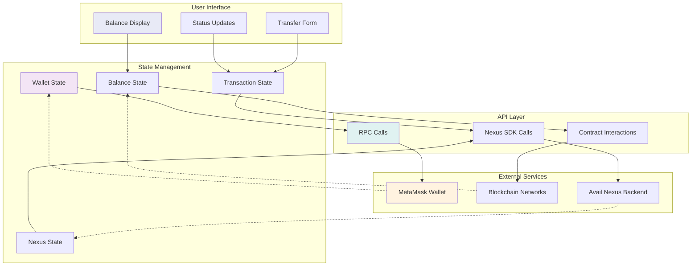

# 🔀 Data Flow Diagram

This diagram illustrates the data flow between different components and external services in the Nexus Pay application.



## Data Flow Description

### User Interface Layer
- **Balance Display**: Shows unified PYUSD balances across all chains
- **Transfer Form**: Handles user input for cross-chain transfers
- **Status Updates**: Real-time transaction progress and notifications

### State Management Layer
- **Wallet State**: Manages wallet connection status and account information
- **Nexus State**: Tracks Nexus SDK initialization and intent status
- **Balance State**: Stores and manages multi-chain balance data
- **Transaction State**: Handles transfer progress and transaction history

### API Layer
- **RPC Calls**: Direct blockchain RPC interactions for balance queries
- **Contract Interactions**: Smart contract calls for PYUSD operations
- **Nexus SDK Calls**: Cross-chain intent creation and execution

### External Services
- **MetaMask Wallet**: User's Web3 wallet for transaction signing
- **Blockchain Networks**: Ethereum Sepolia, Arbitrum Sepolia, Polygon Amoy
- **Avail Nexus Backend**: Cross-chain infrastructure and intent processing

## Data Flow Patterns

### 1. Balance Retrieval Flow
```
UI1 → SM3 → API2 → EXT2 → SM3 → UI1
```
User requests balance → State manager → Contract calls → Blockchain → Updated state → UI update

### 2. Transfer Initiation Flow
```
UI2 → SM4 → API3 → EXT3 → SM2 → UI3
```
User submits transfer → Transaction state → Nexus SDK → Backend processing → Status updates

### 3. Wallet Management Flow
```
EXT1 → SM1 → API1 → EXT1
```
Wallet events → State updates → RPC calls → Wallet responses

### 4. Real-time Updates
```
EXT3 → SM2 → UI3
EXT2 → SM3 → UI1
```
Backend events → State changes → UI notifications
Blockchain events → Balance updates → Display refresh

## Key Features

- **Reactive State Management**: Automatic UI updates on state changes
- **Real-time Synchronization**: Live data from blockchain and Nexus backend
- **Error Propagation**: Comprehensive error handling throughout the flow
- **Cache Management**: Efficient data caching for optimal performance
- **Event-Driven Updates**: Responsive to external service events
