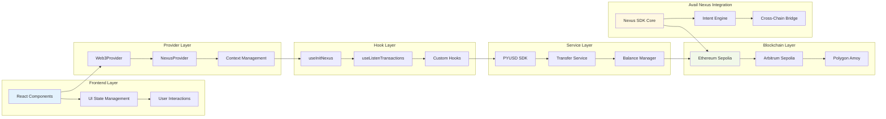

# 📊 Technical Architecture Flow

This diagram shows the technical architecture and layer interactions in the Nexus Pay application.

## Architecture Overview

### Frontend Layer
- **React Components**: Modern React 19.1.0 components with concurrent features
- **UI State Management**: Centralized state management for UI interactions
- **User Interactions**: Event handling and user input processing

### Provider Layer
- **Web3Provider**: Wagmi configuration for Ethereum interactions
- **NexusProvider**: Avail Nexus SDK provider with context management
- **Context Management**: React Context for global state sharing

### Hook Layer
- **useInitNexus**: Custom hook for Nexus SDK initialization
- **useListenTransactions**: Real-time transaction monitoring
- **Custom Hooks**: Additional hooks for specific functionality

### Service Layer
- **PYUSD SDK**: Multi-chain PYUSD balance and transfer management
- **Transfer Service**: Cross-chain transfer orchestration
- **Balance Manager**: Real-time balance aggregation and caching

### Blockchain Layer
- **Ethereum Sepolia**: Primary testnet for PYUSD operations
- **Arbitrum Sepolia**: L2 scaling solution integration
- **Polygon Amoy**: Additional network support

### Avail Nexus Integration
- **Nexus SDK Core**: Core cross-chain functionality
- **Intent Engine**: Intent-based transaction processing
- **Cross-Chain Bridge**: Advanced bridging capabilities

## Key Integrations

1. **Next.js 15.5.4** with App Router for modern React architecture
2. **TypeScript 5** for complete type safety
3. **Wagmi 2.18.2** for type-safe Ethereum interactions
4. **Viem 2.38.3** for lightweight blockchain client
5. **Hardhat 3.0.9** for development and testing infrastructure
