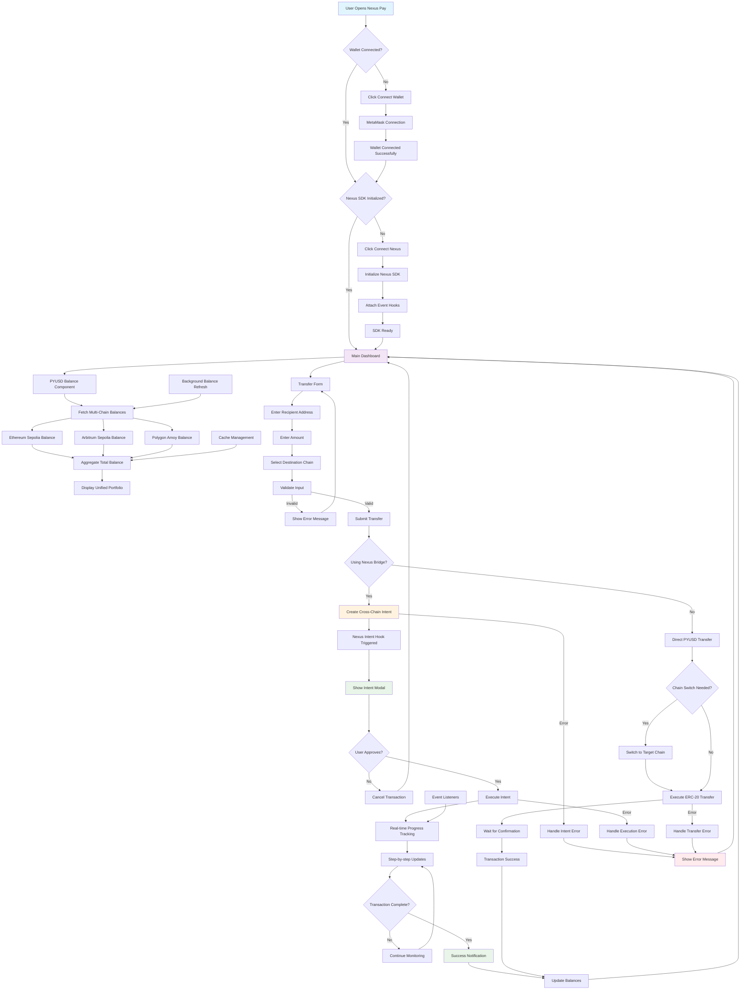

# 🔄 Nexus Pay - User Flow Chart

This flowchart shows the complete user journey from opening the application to completing a cross-chain PYUSD transfer.

## Flow Description

### 1. Initial Setup
- User opens the Nexus Pay application
- System checks for wallet connection status
- If no wallet connected, prompts for MetaMask connection

### 2. Nexus SDK Initialization
- After wallet connection, checks Nexus SDK status
- If not initialized, provides "Connect Nexus" button
- Initializes SDK with event hooks and error handling

### 3. Balance Management
- Fetches PYUSD balances from all supported chains
- Aggregates total balance for unified view
- Displays chain-specific breakdown

### 4. Transfer Process
- User fills transfer form with recipient, amount, and destination
- Form validation ensures data integrity
- System determines transfer method (Nexus bridge vs direct transfer)

### 5. Cross-Chain Intent (Nexus Bridge)
- Creates cross-chain intent through Nexus SDK
- Shows intent modal with fees and routing details
- User approval triggers intent execution
- Real-time progress tracking with step updates

### 6. Direct Transfer (Same Chain)
- Handles chain switching if necessary
- Executes standard ERC-20 transfer
- Waits for blockchain confirmation

### 7. Error Handling
- Comprehensive error handling at each step
- User-friendly error messages
- Graceful fallback to main dashboard

### 8. Background Processes
- Automatic balance refreshing
- Event listeners for transaction updates
- Cache management for optimal performance
